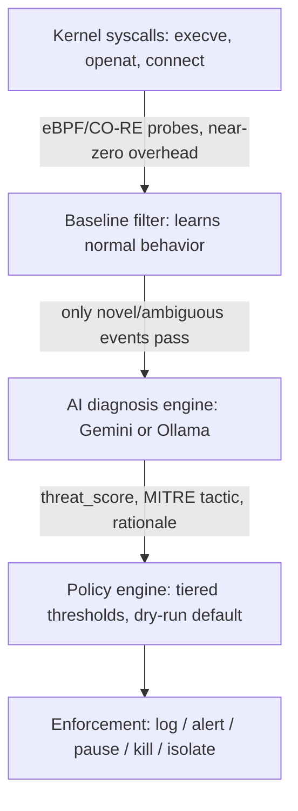

# WatchBPF

**Real-time Linux kernel threat detection & automated remediation, powered by eBPF + LLM reasoning.**

WatchBPF traces critical syscalls at the kernel level using eBPF/CO-RE, filters out normal behavior with a self-learning baseline, and sends only genuinely novel or suspicious activity to an LLM (your own free Gemini API key, or a local Ollama model) for contextual threat scoring. Based on that score, a tiered policy engine can alert, pause, or terminate the offending process — with safety-first defaults throughout.

Single static binary. No vendor lock-in. Bring your own key, or run fully offline.

> **Status:** Core engine, packaging, and cross-platform support are complete and tested — including a from-scratch build and live test on real ARM64 hardware (AWS Graviton).

---

## Why WatchBPF?

Most open eBPF security tools stop at detection: they fire an alert and leave triage and response to you. Enterprise tools that close that loop (Tetragon, CrowdStrike, Datadog) are heavy, closed, or expensive. WatchBPF is built to close the gap for solo developers, homelab/K8s tinkerers, and small teams who want more than raw `auditd` logs but can't justify an enterprise contract.

| | Falco | Tetragon | **WatchBPF** |
|---|:---:|:---:|:---:|
| eBPF kernel-level tracing | ✅ | ✅ | ✅ |
| AI-based contextual threat scoring | ❌ | ❌ | ✅ (Gemini / Ollama) |
| Autonomous remediation | ❌ Alerts only | ✅ Policy-based | ✅ LLM-informed + policy-based |
| Free, zero mandatory API cost | ✅ | ✅ | ✅ (BYOK, or fully offline via Ollama) |
| Single static binary | ❌ | ❌ | ✅ |
| Beginner-friendly install | ❌ | ❌ | ✅ One-command install script |
| ARM64 support | ✅ | ✅ | ✅ (tested on real hardware) |

WatchBPF isn't claiming to be the first eBPF security tool — it combines AI-driven reasoning with real enforcement in a package anyone can install and run for free.

---

## How It Works



1. **eBPF probes** trace `execve` (with arguments), `openat`, and `connect` (IPv4 and IPv6) at the kernel level with near-zero overhead.
2. A **baseline/allowlist filter** learns normal system behavior during an initial learning window, normalizing numeric tokens (PIDs, etc.) so dynamic-but-benign patterns don't cause noise. Only genuinely novel events get escalated — this is what keeps LLM usage low.
3. Escalated events are packaged into a compact "event story" and sent to an **LLM** — your own Gemini API key, or a local Ollama model as a free, fully offline fallback — which returns a structured threat score, MITRE ATT&CK tactic, and recommended action. LLM calls run asynchronously and are concurrency-limited so a slow response never blocks event capture.
4. A **policy engine** applies tiered, threshold-based decisions with safety guardrails: dry-run mode by default, a protected-process list, and a rate limit on escalations per minute to prevent LLM overload or action storms.
5. When enabled (`-enforce=live`), the **enforcement module** can pause (SIGSTOP) or kill (SIGKILL) processes and isolate suspicious IPs via nftables.
6. Every decision — including rate-limited ones — is written to a **tamper-evident, hash-chained audit log**.

**Supported architectures:** x86_64 and ARM64 (verified on real AWS Graviton hardware).

---

## How to Use WatchBPF

WatchBPF can be run three ways depending on your setup. Pick whichever fits — all three run the exact same engine.

### Option 1 — Bare metal / VM (systemd), the simplest way

Best for: a single server, VPS, or personal machine you want protected directly.

```bash
git clone https://github.com/sonujha78/watchbpf.git
cd watchbpf
bash deploy/install.sh
sudo systemctl start watchbpf
sudo journalctl -u watchbpf -f
```

That's it — WatchBPF is now running in **dry-run mode** (observing and logging, taking no action). See [Configuration](#configuration) below to add an AI key or tune settings, and [Enabling Live Enforcement](#enabling-live-enforcement) when you're ready for it to actually act.

### Option 2 — Docker

Best for: running WatchBPF alongside other containerized services, or when you don't want to install anything system-wide.

```bash
git clone https://github.com/sonujha78/watchbpf.git
cd watchbpf
docker build -t watchbpf:latest .

docker run --rm \
  --privileged \
  --pid=host \
  -v /sys/kernel/debug:/sys/kernel/debug:rw \
  -v /sys/kernel/btf:/sys/kernel/btf:ro \
  -v /etc/watchbpf:/etc/watchbpf \
  watchbpf:latest
```

`--privileged` and `--pid=host` are required because WatchBPF traces syscalls across the entire host, not just its own container. Mount `/etc/watchbpf` so your baseline and config persist across container restarts. The container always traces the **host kernel** — containers don't carry their own kernel.

### Option 3 — Kubernetes (Helm)

Best for: protecting every node in a cluster. WatchBPF runs as a DaemonSet — one pod per node, each watching its own node's kernel.

```bash
git clone https://github.com/sonujha78/watchbpf.git
cd watchbpf
docker build -t watchbpf:latest .
# push watchbpf:latest to a registry your cluster can pull from, or load it directly (e.g. `minikube image load watchbpf:latest` for local testing)

helm install watchbpf deploy/helm/watchbpf/ \
  --set geminiApiKey="your-key-here"   # omit this line to use local Ollama instead

kubectl get pods -l app=watchbpf
kubectl logs -l app=watchbpf --tail=50
```

Adjust thresholds, enforcement mode, and resource limits in `deploy/helm/watchbpf/values.yaml` before installing, or override them with `--set` flags.

---

## Configuration

WatchBPF works out of the box with sensible defaults (CLI flags for `-mode`, `-enforce`, `-state`). For fine-grained control, create `/etc/watchbpf/config.yaml`:

```yaml
thresholds:
  alert: 40
  soft: 70
  hard: 90

protected_processes:
  - systemd
  - sshd
  - kubelet
  - containerd
  - watchbpf-agent

rate_limit:
  max_per_minute: 50

llm:
  ollama_model: llama3.1:8b
  ollama_url: http://localhost:11434
```

The config file is optional — if it doesn't exist, WatchBPF falls back to defaults automatically. Any field you omit also falls back to its default.

### Adding your own LLM backend (optional)

WatchBPF works out of the box via a local Ollama model — no cost, fully offline. To use Gemini's free tier instead:

```bash
sudo mkdir -p /etc/watchbpf
sudo nano /etc/watchbpf/gemini.key
# paste your free Gemini API key from https://aistudio.google.com/app/apikey
sudo chmod 600 /etc/watchbpf/gemini.key
sudo systemctl restart watchbpf
```

### Enabling Live Enforcement

By default WatchBPF only observes and logs. To let it actually pause/kill processes and isolate IPs, edit `/etc/systemd/system/watchbpf.service` (or your Helm `values.yaml`) and change `-enforce=dry-run` to `-enforce=live`, then restart. **Review dry-run output for a while first** — see what it *would* have done before letting it act.

---

## Safety Guardrails

WatchBPF can terminate processes and firewall IPs — that capability is treated as non-negotiable to guard carefully:

- **Dry-run by default** — no destructive action until you explicitly enable live enforcement.
- **Protected-process list** — critical system processes (`sshd`, `systemd`, `kubelet`, containerd, WatchBPF itself, etc.) are downgraded to alert-only, never hard-killed.
- **Rate-limited escalations** — caps how many events per minute get sent to the LLM at all, so a burst of activity can't overload the AI backend or trigger an action storm.
- **Strict output validation** — the LLM's threat score and recommended action are checked against fixed bounds/enum server-side; malformed or off-schema responses are always treated as log-only, never acted on.
- **Self-feedback-loop guard** — WatchBPF's own process and its LLM backend's traffic are excluded from analysis, so it never analyzes itself.
- **Fail-safe on API failure** — if Gemini/Ollama is unreachable or times out, the event is logged and skipped rather than blocking or failing open.
- **Tamper-evident audit log** — every decision (including rate-limited ones) is written to `/var/log/watchbpf-audit.log` as a hash-chained JSON record; any tampering breaks the chain and is detectable via verification.

---

## Response Tiers

The policy engine maps LLM threat scores to response tiers:

| Threat Score | Tier | Action (when `-enforce=live`) |
|---|---|---|
| 0–39 | Log | Logged only |
| 40–69 | Alert | Logged, flagged as alert |
| 70–89 | Soft action | Process paused (SIGSTOP) |
| 90–100 | Hard action | Process killed (SIGKILL) + IP isolated (nftables) |

Protected processes and rate-limited events are automatically downgraded to Alert regardless of score.

---

## Observability

WatchBPF exposes a Prometheus-compatible `/metrics` endpoint (default `:9090/metrics`, configurable via `-metrics-addr`):

```bash
curl localhost:9090/metrics
```

Tracked metrics include:
- `watchbpf_events_processed_total{event_type}` — raw kernel events seen, by type
- `watchbpf_events_escalated_total{event_type}` — events that passed the baseline filter
- `watchbpf_events_rate_limited_total` — escalations skipped due to rate limiting
- `watchbpf_llm_calls_total{backend,result}` — LLM calls by backend and success/error
- `watchbpf_decisions_total{tier}` — policy decisions by tier (log/alert/soft/hard)

Point any Prometheus instance at this endpoint to build dashboards or alerts — no additional setup required on WatchBPF's side.

---

## Known Limitations

- Local Ollama models are noticeably slower than Gemini's API and can fall behind under bursty event volume — the rate-limiting guardrail exists specifically to handle this gracefully.
- Docker/Kubernetes deployments track the host kernel, not container-internal state — baselines should be seeded per-node.

## License

Apache License 2.0

## Author

Built and maintained by [@sonujha78](https://github.com/sonujha78).
