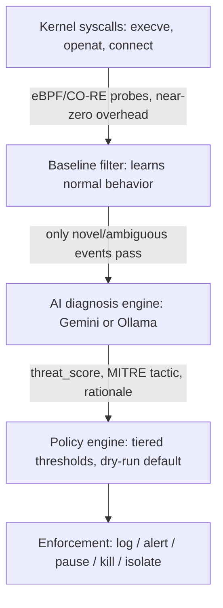

# WatchBPF

**Real-time Linux kernel threat detection & automated remediation, powered by eBPF + LLM reasoning.**

WatchBPF traces critical syscalls at the kernel level using eBPF/CO-RE, filters out normal behavior with a self-learning baseline, and sends only genuinely novel or suspicious activity to an LLM (your own free Gemini API key, or a local Ollama model) for contextual threat scoring. Based on that score, a tiered policy engine can alert, pause, or terminate the offending process — with safety-first defaults throughout.

Single static binary. No vendor lock-in. Bring your own key, or run fully offline.

> **Status:** Core engine (kernel tracing → baseline filter → AI scoring → policy-based enforcement) complete and tested. Packaging in progress.

---

## Why WatchBPF?

Most open eBPF security tools stop at detection: they fire an alert and leave triage and response to you. Enterprise tools that close that loop (Tetragon, CrowdStrike, Datadog) are heavy, closed, or expensive. WatchBPF is built to close the gap for solo developers, homelab/K8s tinkerers, and small teams who want more than raw `auditd` logs but can't justify an enterprise contract.

| | Falco | Tetragon | **WatchBPF** |
|---|:---:|:---:|:---:|
| eBPF kernel-level tracing | ✅ | ✅ | ✅ |
| AI-based contextual threat scoring | ❌ | ❌ | ✅ (Gemini / Ollama) |
| Autonomous remediation | ❌ Alerts only | ✅ Policy-based | ✅ LLM-informed + policy-based |
| Free, zero mandatory API cost | ✅ | ✅ | ✅ (BYOK, or fully offline via Ollama) |
| Single static binary | ❌ | ❌ | ✅ |
| Beginner-friendly install | ❌ | ❌ | ✅ One-command install script |

WatchBPF isn't claiming to be the first eBPF security tool — it combines AI-driven reasoning with real enforcement in a package anyone can install and run for free.

---

## How It Works



1. **eBPF probes** trace `execve` (with arguments), `openat`, and `connect` at the kernel level with near-zero overhead.
2. A **baseline/allowlist filter** learns normal system behavior during an initial learning window, normalizing numeric tokens (PIDs, etc.) so dynamic-but-benign patterns don't cause noise. Only genuinely novel events get escalated — this is what keeps LLM usage low.
3. Escalated events are packaged into a compact "event story" and sent to an **LLM** — your own Gemini API key, or a local Ollama model as a free, fully offline fallback — which returns a structured threat score, MITRE ATT&CK tactic, and recommended action. LLM calls run asynchronously and are concurrency-limited so a slow response never blocks event capture.
4. A **policy engine** applies tiered, threshold-based decisions with safety guardrails: dry-run mode by default, a protected-process list, and a rate limit on escalations per minute to prevent LLM overload or action storms.
5. When enabled (`-enforce=live`), the **enforcement module** can pause (SIGSTOP) or kill (SIGKILL) processes and isolate suspicious IPs via nftables.

---

## Quick Start

### Requirements

- Linux kernel 5.15+ with BTF support (`/sys/kernel/btf/vmlinux` must exist)
- x86_64 (arm64 support planned)

### Install

```bash
git clone https://github.com/sonujha78/watchbpf.git
cd watchbpf
bash deploy/install.sh
```

### Run (dry-run mode, safe by default)

```bash
sudo systemctl start watchbpf
sudo journalctl -u watchbpf -f
```

WatchBPF starts in **dry-run mode**: it observes and logs what it *would* do, without taking any action. Review its behavior on your system for a while before enabling live enforcement.

### Add your own LLM backend (optional)

WatchBPF works out of the box via a local Ollama model — no cost, fully offline. To use Gemini's free tier instead:

```bash
sudo mkdir -p /etc/watchbpf
sudo nano /etc/watchbpf/gemini.key
# paste your free Gemini API key from https://aistudio.google.com/app/apikey
sudo chmod 600 /etc/watchbpf/gemini.key
sudo systemctl restart watchbpf
```

### Enable live enforcement (only after reviewing dry-run behavior)

Edit `/etc/systemd/system/watchbpf.service` and change `-enforce=dry-run` to `-enforce=live`, then:

```bash
sudo systemctl daemon-reload
sudo systemctl restart watchbpf
```

---

## Safety Guardrails

WatchBPF can terminate processes and firewall IPs — that capability is treated as non-negotiable to guard carefully:

- **Dry-run by default** — no destructive action until you explicitly enable live enforcement.
- **Protected-process list** — critical system processes (`sshd`, `systemd`, `kubelet`, containerd, WatchBPF itself, etc.) are downgraded to alert-only, never hard-killed.
- **Rate-limited escalations** — caps how many events per minute get sent to the LLM at all, so a burst of activity can't overload the AI backend or trigger an action storm.
- **Strict output validation** — the LLM's threat score and recommended action are checked against fixed bounds/enum server-side; malformed or off-schema responses are always treated as log-only, never acted on.
- **Self-feedback-loop guard** — WatchBPF's own process and its LLM backend's traffic are excluded from analysis, so it never analyzes itself.
- **Fail-safe on API failure** — if Gemini/Ollama is unreachable or times out, the event is logged and skipped rather than blocking or failing open.

---

## Response Tiers

The policy engine maps LLM threat scores to response tiers:

| Threat Score | Tier | Action (when `-enforce=live`) |
|---|---|---|
| 0–39 | Log | Logged only |
| 40–69 | Alert | Logged, flagged as alert |
| 70–89 | Soft action | Process paused (SIGSTOP) |
| 90–100 | Hard action | Process killed (SIGKILL) + IP isolated (nftables) |

Protected processes and rate-limited events are automatically downgraded to Alert regardless of score.

---

## Known Limitations

- Local Ollama models are noticeably slower than Gemini's API and can fall behind under bursty event volume — the rate-limiting guardrail exists specifically to handle this gracefully.
- Configuration is currently via CLI flags only (`-mode`, `-enforce`, `-state`); a YAML config file is planned but not yet implemented.
- No persistent audit log yet — output currently goes to stdout/journald only.
- IPv6 `connect` events are not yet captured (IPv4 only).

## Roadmap

- [ ] Docker image
- [ ] Persistent, tamper-evident audit log
- [ ] YAML-based configuration
- [ ] Helm chart / K8s DaemonSet
- [ ] arm64 support
- [ ] Prometheus metrics endpoint
- [ ] Public launch

## License

Apache License 2.0

## Author

Built and maintained by [@sonujha78](https://github.com/sonujha78).
